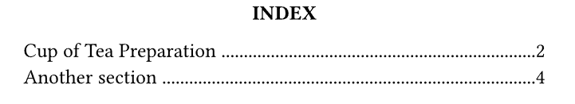
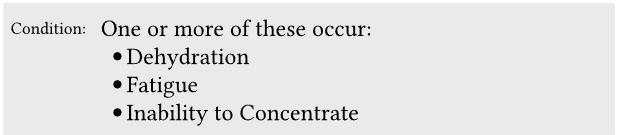
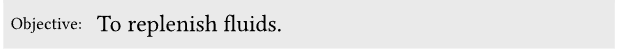
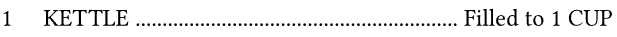
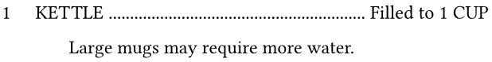
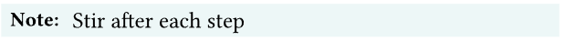
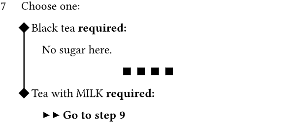

# Typst QRH Template

Creates aviation style checklists like Quick Reference Handbooks.

### Supported features:

- Index
- Section
- Conditions
- Objective
- Step (When/If)
- Sub Step
- Caution
- Note
- Choose One
- Go to step
- End section now

#### Index

An index with an entry for each section in the document.

```typst
#index()
```



#### Section

A section title, forces capitalisation.

```typst
#section("Cup of Tea preparation")[
    //.. Rest of section goes here
]
```


#### Conditions

Conditionals for this section.

```typst
#condition[
    - Dehydration
    - Fatigue
    - Inability to Concentrate
]
```



#### Conditions

An objective for this section (optional).

```typst
#objective[To replenish fluids.]
```



#### Step

A numbered step in the checklist. The first parameter is to the left of the dotted line, the second is to the right. If the second parameter is `""` then there is no dotted line.

```typst
#step("KETTLE", "Filled to 1 CUP")
#step([*When* KETTLE boiled:], "")
#step([*If* sugar required], "")
```




#### Tab

Indents contents by one tab.

```typst
#tab(goToStep("9"))
#tab(tab("Large mugs may require more water."))
```




#### Caution

Adds a caution element.

```typst
#caution([HOT WATER #linebreak()Adult supervision required.])
```


#### Note

Adds a note.

```typst
#note("Stir after each step")
```



#### Choose One

A numbered step with options.

```typst
 #chooseOne[
    #option[Black tea *required:*]
    #option[Tea with MILK *required:*]
  ]
```



#### Go to step

Two right facing arrow heads followed by Go to step `step number`. Links to step in pdf.

```typst
#goToStep("9")
```


#### End now

Ends the section now with 4 dots.

```typst
#endNow()
```


